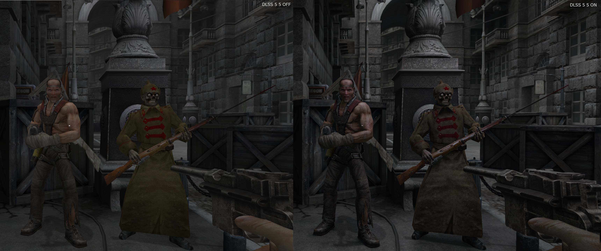
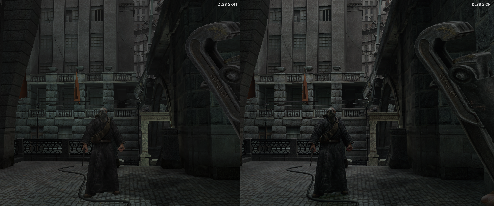

# You Are Empty — DLSS 5 Neural Rendering

**English** | [Русский](README.ru.md) | [Українська](README.uk.md)

An experimental DLSS Neural Rendering setup for the original 32-bit OpenGL
version of **You Are Empty**.

Processing chain:

```text
You Are Empty x86/OpenGL
  -> ReShade x86
  -> DLSS5-Feeder32
  -> host64 / D3D12
  -> OptiScaler
  -> DLSS/DLAA + DLSS Neural Rendering
```

## Examples

Each image shows the original picture with DLSS 5 disabled on the left and the
result with DLSS 5 Neural Rendering enabled on the right.





## One-command installation

Open PowerShell and run:

```powershell
irm 'https://raw.githubusercontent.com/OpenYAE/yae-dlss5/main/install.ps1' | iex
```

A folder picker will open. Select the game folder that contains:

```text
YOU_ARE_EMPTY.exe
```

The game EXE hash is intentionally not restricted, so modified builds are
allowed. The game must remain 32-bit and use OpenGL.

To run it from `cmd.exe`, the Run dialog or a shortcut, use the full form:

```cmd
powershell.exe -NoProfile -ExecutionPolicy Bypass -Command "irm 'https://raw.githubusercontent.com/OpenYAE/yae-dlss5/main/install.ps1' | iex"
```

The command downloads the current version of this public repository to a
temporary folder, runs the main installer and removes the temporary files when
it finishes.

You can review the remote script before running it:
[install.ps1](https://github.com/OpenYAE/yae-dlss5/blob/main/install.ps1).

## Requirements

- Windows 10/11 x64.
- The original x86/OpenGL version of the game with `YOU_ARE_EMPTY.exe`.
- An NVIDIA GeForce RTX 50 series GPU for the Neural Rendering model used.
- A recent NVIDIA driver; tested on an RTX 5090 with driver 616.92.
- Access to GitHub during installation.
- Write access to the game folder.

## What the installer does

- downloads the missing LumeniteFX and NVIDIA NGX runtime from pinned sources;
- verifies the SHA-256 of the DLSS-NR archive and the digital signatures of the NVIDIA DLLs;
- backs up replaced files to `_DLSS5-Backups`;
- installs ReShade, DLSS5-Feeder and OptiScaler;
- runs a built-in configuration check.

The installer does not change the driver, the registry, Windows Defender,
system directories or global Vulkan layers.

## Controls

- `Home` — ReShade menu.
- `Insert` — host64/OptiScaler panel.
- The ReShade effects toggle key defaults to VK 222 and may appear as the
  apostrophe or `Э` key. It can be changed in the ReShade settings.

## Manual and offline installation

Download the repository via **Code → Download ZIP**, extract it and run
`Setup-YAE-DLSS5.cmd`. Full instructions, manual retrieval of dependencies and
restoring from a backup are described in [README.txt](README.txt) (in Russian).

## Experimental status

This package is intended for single-player use. Do not use injectors like this
in online games protected by anti-cheat. When reporting an issue, attach the
ReShade, DLSS5-Feeder and OptiScaler logs with personal paths removed.

## Third-party components

The game and its EXE are not distributed. The NVIDIA runtime and LumeniteFX are
not stored in the repository and are downloaded by the installer from their
original sources. Other included components retain their own licenses; their
texts are in [`THIRD-PARTY-NOTICES`](THIRD-PARTY-NOTICES).

The installer and its scripts are under the MIT license ([LICENSE](LICENSE)).
